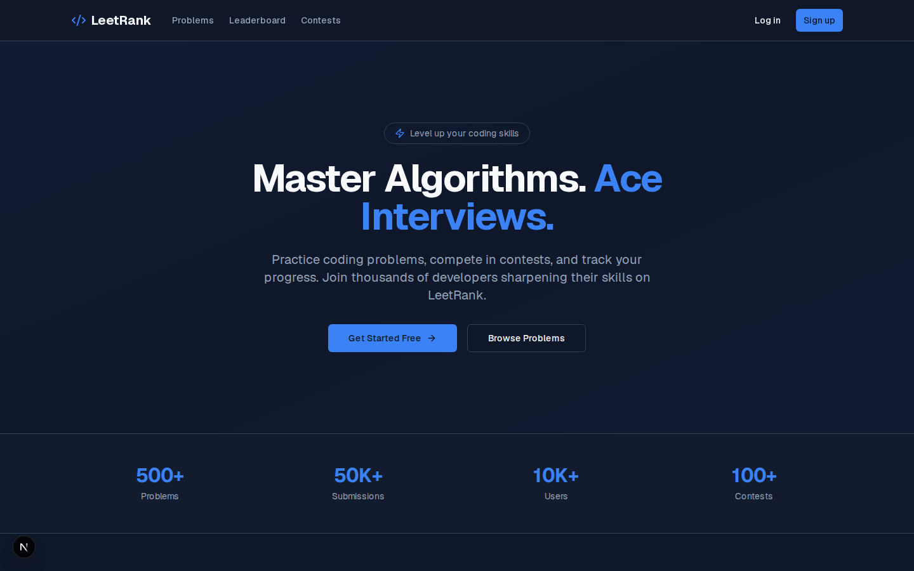
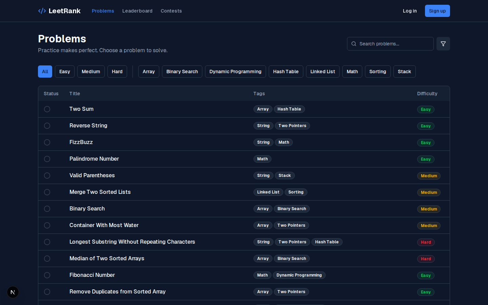
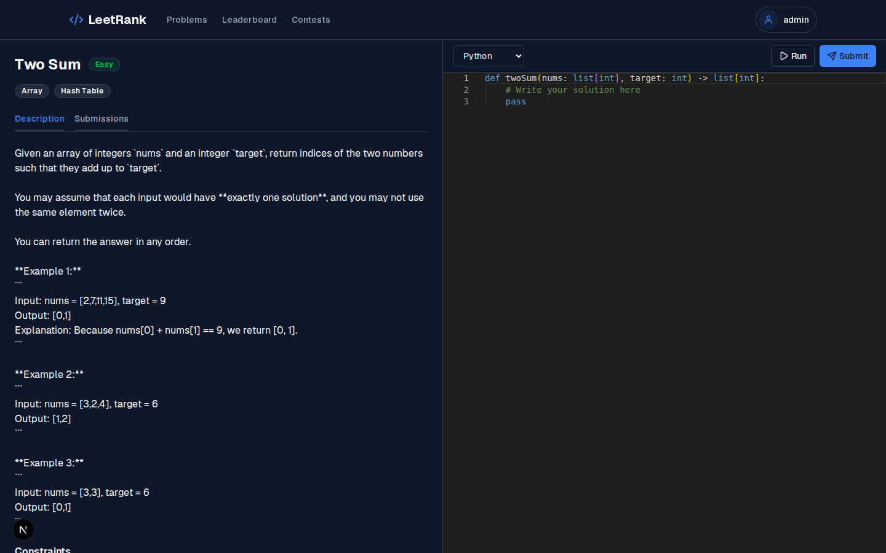
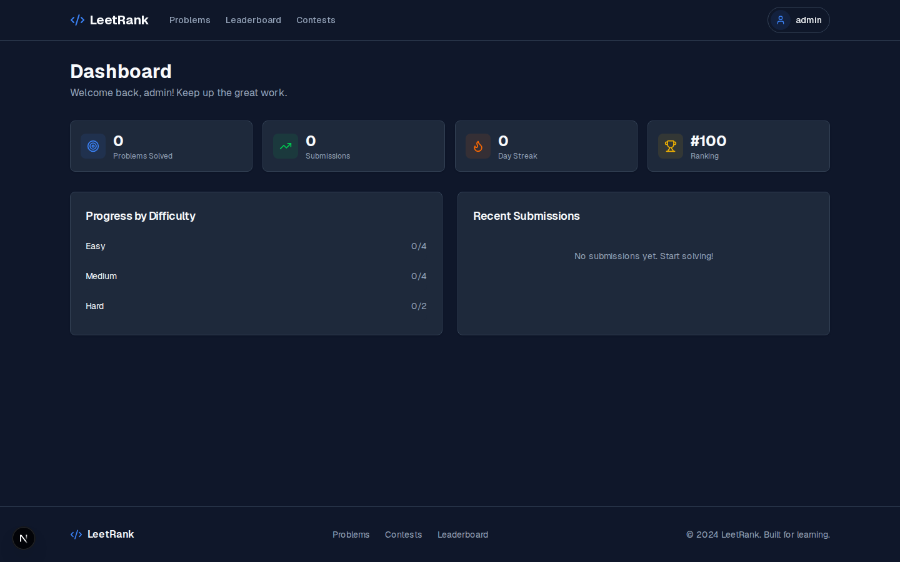
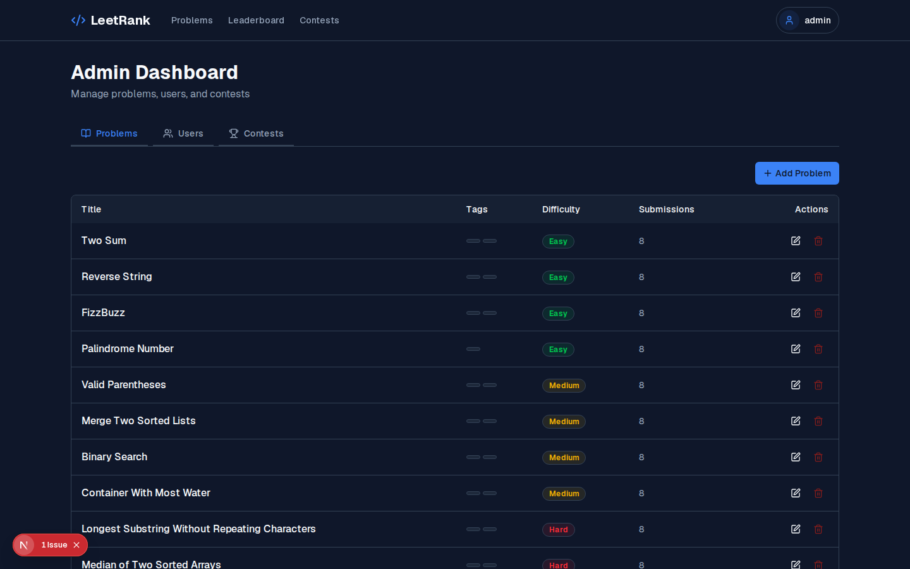
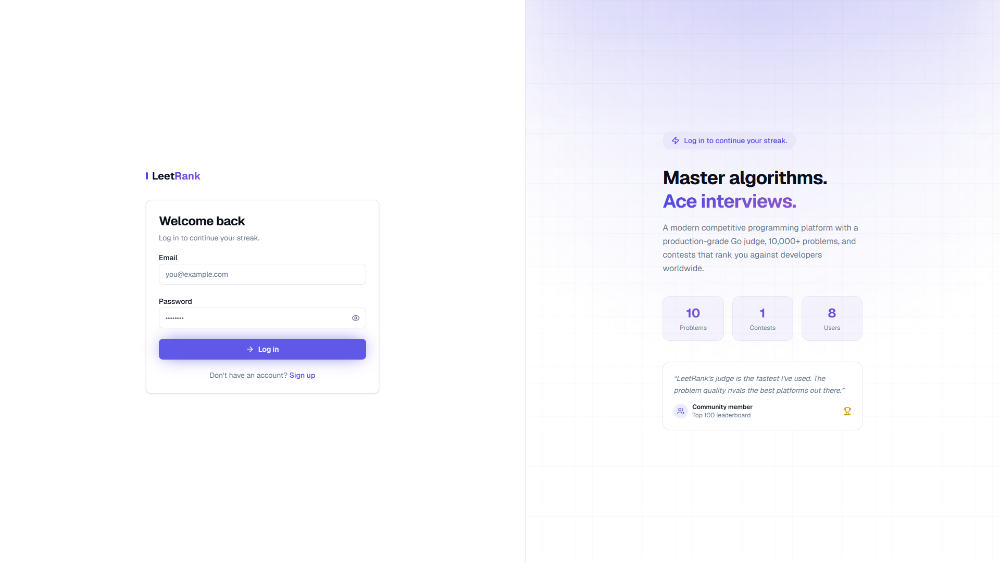

<div align="center">

<h1>LeetRank</h1>

<p><strong>A competitive programming platform for practicing algorithms and data structures</strong></p>

<p>
  <a href="https://github.com/JasonTM17/Leetrank_Project/actions/workflows/ci.yml">
    
  </a>
  <a href="https://github.com/JasonTM17/Leetrank_Project/blob/main/LICENSE">
    
  </a>
  <a href="https://github.com/JasonTM17/Leetrank_Project/stargazers">
    
  </a>
  <a href="https://github.com/JasonTM17/Leetrank_Project/issues">
    
  </a>
</p>

<p>
  
  
  
  
  
</p>

<p>
  <a href="#features">Features</a> •
  <a href="#tech-stack">Tech Stack</a> •
  <a href="#getting-started">Getting Started</a> •
  <a href="#architecture">Architecture</a> •
  <a href="#screenshots">Screenshots</a> •
  <a href="#api-reference">API Reference</a>
</p>

</div>

---

<details>
<summary><strong>Table of Contents</strong></summary>

- [About](#about)
- [Features](#features)
- [Tech Stack](#tech-stack)
- [Architecture](#architecture)
- [Screenshots](#screenshots)
- [Getting Started](#getting-started)
  - [Prerequisites](#prerequisites)
  - [Installation](#installation)
  - [Docker](#docker)
  - [Environment Variables](#environment-variables)
- [Usage](#usage)
- [API Reference](#api-reference)
- [Judge Service](#judge-service)
- [Testing](#testing)
- [Deployment](#deployment)
- [Roadmap](#roadmap)
- [Contributing](#contributing)
- [License](#license)

</details>

---

## About

LeetRank is a full-stack competitive programming platform inspired by LeetCode and HackerRank. It provides a complete environment for practicing coding problems, participating in contests, and tracking progress on a leaderboard.

The platform features a production-grade code judge service written in Go that supports Python, JavaScript, and Ruby with sandboxed execution, time/memory limits, and security blocklists.

### Why LeetRank?

- 30+ algorithm problems across Easy, Medium, and Hard difficulties
- Real-time code execution with Monaco Editor (VS Code's editor)
- Contest system with live rankings
- Multi-language judge service (Go backend, Python/JS/Ruby runners)
- Full admin dashboard for problem and contest management

---

## Features

| Feature | Description |
|---------|-------------|
| Problem Library | 30+ problems with descriptions, examples, constraints, hints, and starter code |
| Code Editor | Monaco Editor with syntax highlighting, autocomplete, and multi-language support |
| Judge Service | Go-based sandboxed execution with Python, JavaScript, and Ruby runners |
| Contests | Timed competitions with live leaderboard and problem sets |
| User Dashboard | Personal stats, submission history, and progress tracking |
| Leaderboard | Global rankings by problems solved and contest performance |
| Admin Panel | CRUD for problems, users, contests, and test cases |
| Authentication | JWT-based auth with httpOnly cookies, bcrypt password hashing |
| Dark Mode | Full dark/light theme support |
| Responsive | Mobile-first design with Tailwind CSS |

---

## Tech Stack

<div align="center">

| Layer | Technology |
|-------|------------|
| **Frontend** |     |
| **Editor** |  |
| **Backend** |   |
| **Judge** |    |
| **Database** | -003B57?style=flat-square&logo=sqlite) -4169E1?style=flat-square&logo=postgresql&logoColor=white) |
| **State** |  |
| **Auth** | -000?style=flat-square&logo=jsonwebtokens)  |
| **DevOps** |   |

</div>

---

## Architecture

LeetRank is a multi-service platform. The Next.js app is the UI + remaining canonical handlers; the Hono API service owns ported read-only routes; the Go judge runs sandboxed code; n8n drives the chatbot workflow; Caddy is the edge.

### Service inventory

| Service | Tech | Port | Image | Role |
|---|---|---|---|---|
| `app` | Next.js 16 | 3000 | `jasontm17/leetrank-app` | UI + remaining /api/* |
| `api` | Hono + Node 20 | 4000 | `jasontm17/leetrank-api` | Ported read-only routes (`/api/v1/*`) |
| `auth` | Hono + Node 20 | 4001 | `jasontm17/leetrank-auth` | JWKS + auth (Phase 3.1) |
| `judge` | Go 1.21 | 9090 | `jasontm17/leetrank-judge` | Sandboxed code execution (34 languages) |
| `n8n` | n8n 1.70 | 5678 | upstream `n8nio/n8n` | Chatbot workflow runtime |
| `postgres` | Postgres 16-alpine | 5432 | upstream | OLTP store |
| `redis` | Redis 7-alpine | 6379 | upstream | Cache + (future) Streams |
| `caddy` | Caddy 2 | 80/443 | upstream | TLS, path routing, rate limit |

Observability stack ships in `docker-compose.observability.yml` (opt-in): Prometheus, Grafana, Loki, Promtail, postgres-exporter, redis-exporter.

### Repository layout

```
LeetRank_Project/
├── apps/
│   ├── api/                    # Hono read-only API service (port 4000)
│   └── auth/                   # Auth service scaffold (port 4001)
├── packages/
│   ├── api-contracts/          # Shared zod schemas + types
│   └── auth-verify/            # JWT/JWKS verifier + Hono middleware
├── src/                        # Next.js app (Server Components + remaining routes)
│   ├── app/                    # App Router pages + /api/* (being ported out)
│   ├── components/             # UI primitives, problem editor, chat widget
│   ├── lib/                    # rate-limit, queue, cache, admin-guard, …
│   └── services/               # Judge client, business logic
├── judge-service/              # Go judge — registry-driven, 34 languages
│   ├── main.go
│   ├── languages.json          # Language registry (single source of truth)
│   ├── languages.go            # Go-side registry loader
│   ├── exec.go                 # Generic compile + run dispatcher
│   └── runners/                # Python/JS/Ruby/Bash wrappers with setrlimit
├── prisma/
│   ├── schema.prisma
│   ├── seed-bulk.ts            # 1000 problems + 1000 contests deterministic
│   └── …
├── infra/
│   ├── caddy/Caddyfile
│   ├── prometheus/prometheus.yml + alerts.yml
│   ├── loki/loki-config.yml
│   ├── promtail/promtail-config.yml
│   └── n8n/                    # Chatbot workflow docs
├── scripts/
│   └── load-test.mjs           # autocannon harness (smoke/stress/contest-storm)
├── docs/
│   ├── adr/                    # 0001-0016 architecture decisions
│   ├── load-testing.md
│   └── runbooks/docker.md
├── docker-compose.yml                   # Default boot
├── docker-compose.dev.yml               # Hot-reload override
├── docker-compose.observability.yml     # Observability stack overlay
└── .github/workflows/                   # CI + Docker Hub publish + load test
```

<details>
<summary><strong>Service interaction diagram</strong></summary>

```
                    ┌──────────────┐
                    │   Browser    │
                    └──────┬───────┘
                           │ HTTPS
                    ┌──────▼───────┐
                    │  Caddy (80)  │  TLS + rate limit + path routing
                    └──┬───┬───┬───┘
                       │   │   │
            ┌──────────┘   │   └──────────────────────┐
            │              │                          │
       ┌────▼─────┐  ┌─────▼────┐  ┌──────────┐  ┌───▼─────┐
       │   app    │  │   api    │  │  auth    │  │  n8n    │
       │ (Next)   │  │  (Hono)  │  │ (Hono)   │  │ chat    │
       │ :3000    │  │  :4000   │  │ :4001    │  │ :5678   │
       └────┬─────┘  └────┬─────┘  └────┬─────┘  └───┬─────┘
            │             │             │            │
            ├─────────────┼─────────────┼────────────┘
            ▼             ▼             ▼
       ┌──────────┐  ┌──────────┐  ┌──────────┐
       │ postgres │  │  redis   │  │  judge   │
       │  :5432   │  │  :6379   │  │ (Go)     │
       └──────────┘  └──────────┘  │ :9090    │
                                   └──────────┘
```

JWT verification is local in every service (JWKS fetched from `auth` once at boot, cached 30 s). Service-to-service traffic is bounded inside the docker network.

</details>


---

## Screenshots

<table>
<tr>
<td align="center"><strong>Landing Page</strong></td>
<td align="center"><strong>Problems List</strong></td>
</tr>
<tr>
<td></td>
<td></td>
</tr>
<tr>
<td align="center"><strong>Code Editor</strong></td>
<td align="center"><strong>Dashboard</strong></td>
</tr>
<tr>
<td></td>
<td></td>
</tr>
<tr>
<td align="center"><strong>Leaderboard</strong></td>
<td align="center"><strong>Contests</strong></td>
</tr>
<tr>
<td></td>
<td></td>
</tr>
<tr>
<td align="center"><strong>Admin Panel</strong></td>
<td align="center"><strong>Login</strong></td>
</tr>
<tr>
<td></td>
<td></td>
</tr>
</table>

---

## Getting Started

### Prerequisites

- **Node.js** >= 18.x
- **Go** >= 1.21 (for judge service)
- **Docker** & Docker Compose (optional, for containerized setup)

```bash
node --version   # v18+
go version       # go1.21+
docker --version # 24+ (optional)
```

### Installation

```bash
# 1. Clone the repository
git clone https://github.com/JasonTM17/Leetrank_Project.git
cd Leetrank_Project

# 2. Install dependencies
npm install

# 3. Set up environment
cp .env.example .env

# 4. Initialize database
npx prisma migrate dev
npm run db:seed
npm run seed:extra

# 5. Start development server
npm run dev
# App available at http://localhost:3000
```

### Docker

```bash
# Start all services (app + judge)
docker-compose up --build

# App: http://localhost:3000
# Judge: http://localhost:9090
```

### Environment Variables

| Variable | Description | Required | Default |
|----------|-------------|----------|---------|
| `DATABASE_URL` | Database connection string | Yes | `file:./dev.db` |
| `JWT_SECRET` | Secret for JWT token signing (16+ chars; production fails to start otherwise) | Yes (production) | — |
| `JUDGE_SERVICE_URL` | Judge service endpoint | No | `http://localhost:9090` |
| `NEXT_PUBLIC_APP_URL` | Public app URL | No | `http://localhost:3000` |
| `RUNNER_TIMEOUT` | Code execution timeout (seconds) | No | `5` |
| `LOG_LEVEL` | Web logger threshold (`debug`/`info`/`warn`/`error`) | No | `info` |
| `JUDGE_GLOBAL_MAX` | Max concurrent executions across the judge | No | `16` |
| `JUDGE_PER_IP_MAX` | Max concurrent executions per remote IP | No | `4` |
| `JUDGE_QUEUE_WAIT_MS` | How long a request waits for a slot before 503 | No | `10000` |

---

## Usage

### Default Accounts (after seeding)

| Username | Password | Role |
|----------|----------|------|
| `admin` | `password123` | Admin |
| `user1` | `password123` | User |
| `user2` | `password123` | User |

### Running Code

1. Navigate to any problem
2. Write your solution in the Monaco editor
3. Click "Run Code" to test against visible test cases
4. Click "Submit" to run against all test cases (including hidden)

---

## API Reference

<details>
<summary><strong>Authentication</strong></summary>

| Method | Endpoint | Description |
|--------|----------|-------------|
| POST | `/api/auth/register` | Register new user |
| POST | `/api/auth/login` | Login, returns JWT cookie |
| POST | `/api/auth/logout` | Clear auth cookie |
| GET | `/api/auth/me` | Get current user |

</details>

<details>
<summary><strong>Problems</strong></summary>

| Method | Endpoint | Description |
|--------|----------|-------------|
| GET | `/api/problems` | List problems (paginated, filterable) |
| GET | `/api/problems/[slug]` | Get problem by slug |
| GET | `/api/tags` | List all tags |

</details>

<details>
<summary><strong>Code Execution</strong></summary>

| Method | Endpoint | Description |
|--------|----------|-------------|
| POST | `/api/run-code` | Run code against visible test cases |
| POST | `/api/submissions` | Submit solution (all test cases) |
| GET | `/api/submissions` | Get user's submissions |

</details>

<details>
<summary><strong>Contests & Leaderboard</strong></summary>

| Method | Endpoint | Description |
|--------|----------|-------------|
| GET | `/api/contests` | List contests |
| GET | `/api/contests/[slug]` | Get contest details |
| GET | `/api/leaderboard` | Global rankings |

</details>

<details>
<summary><strong>Admin</strong></summary>

| Method | Endpoint | Description |
|--------|----------|-------------|
| GET | `/api/admin/stats` | Dashboard statistics |
| POST | `/api/admin/problems` | Create problem |
| PUT | `/api/admin/problems/[id]` | Update problem |
| DELETE | `/api/admin/problems/[id]` | Delete problem |
| GET | `/api/admin/users` | List all users |

</details>

---

## Judge Service

The judge service is a standalone Go application that executes user-submitted code in a sandboxed environment.

### Security Features

- Per-language blocklists (dangerous imports: `os`, `subprocess`, `exec`, `eval`, etc.)
- Hard time limits (configurable, default 5s)
- Memory limits
- No network access during execution
- Separate process per submission
- Temp file cleanup after execution

### Concurrency & Load Shedding

The judge bounds concurrent executions with a two-tier semaphore:

- **Global cap** (`JUDGE_GLOBAL_MAX`, default 16) — hard ceiling across the whole process.
- **Per-IP cap** (`JUDGE_PER_IP_MAX`, default 4) — prevents a single user from monopolising the queue.
- **Bounded wait queue** (`JUDGE_QUEUE_WAIT_MS`, default 10s) — requests that can't acquire a slot return HTTP 503 with `status=busy` instead of stalling.

The `/health` endpoint reports a live snapshot:

```json
{
  "status": "ok",
  "service": "leetrank-judge",
  "scheduler": {
    "globalMax": 16,
    "perIpMax": 4,
    "inUse": 3,
    "totalAccepted": 421,
    "totalRejected": 12,
    "activeIps": 2
  }
}
```

### Supported Languages

| Language | Runner | Version |
|----------|--------|--------|
| Python | `runners/python_runner.py` | 3.x |
| JavaScript | `runners/js_runner.js` | Node.js |
| Ruby | `runners/ruby_runner.rb` | 3.x |

### Judge API

```bash
POST http://localhost:9090/execute
Content-Type: application/json

{
  "language": "python",
  "code": "print(sum([1,2,3]))",
  "testCases": [
    { "input": "", "expected": "6" }
  ]
}
```

Response:
```json
{
  "results": [
    {
      "status": "accepted",
      "stdout": "6\n",
      "stderr": "",
      "exitCode": 0,
      "timeMs": 45,
      "memoryKb": 32000
    }
  ]
}
```

---

## Testing

```bash
# Type checking
npm run typecheck

# Linting
npm run lint

# Unit + schema tests (Vitest)
npm test

# Build verification
npm run build

# Database reset + reseed
npm run db:reset

# Judge service tests (race detector)
cd judge-service && go test -race ./...
```

The CI workflow runs all of the above plus `npm audit --audit-level=high`
and a multi-stage Docker build for both the app and judge images.

---

## Deployment

<details>
<summary><strong>Docker Compose (Recommended)</strong></summary>

```bash
# Development
docker-compose up --build

# Production (with resource limits)
docker-compose -f docker-compose.prod.yml up --build -d

# Services:
# - app (Next.js): port 3000
# - judge (Go): port 9090
```

</details>

<details>
<summary><strong>Manual Deployment</strong></summary>

```bash
# Build Next.js
npm run build

# Build Judge Service
cd judge-service && go build -o judge-service . && cd ..

# Start both
npm start &
./judge-service/judge-service &
```

</details>

---

## Roadmap

- [x] User authentication (register, login, JWT)
- [x] Problem library with 30+ problems
- [x] Monaco code editor with multi-language support
- [x] Code execution and submission system (Next.js → Go judge over HTTP)
- [x] Contest system with live rankings
- [x] User dashboard and progress tracking
- [x] Global leaderboard (paginated, dedup-aware)
- [x] Admin panel (CRUD problems, users, contests) with Zod-validated payloads
- [x] Go judge service with Python/JS/Ruby runners
- [x] Concurrent execution with global + per-IP semaphores
- [x] Docker containerization (multi-stage, non-root, healthchecks)
- [x] CI pipeline (typecheck, lint, test, build, audit, Go race tests, Docker build)
- [x] Auth middleware for route protection
- [x] `/api/health` with database + judge probes
- [x] Hot-path Prisma indexes
- [x] Structured JSON logger
- [ ] WebSocket real-time contest updates
- [ ] Discussion forum per problem
- [ ] User profiles with badges
- [ ] Solution explanations and editorials
- [ ] C++ and Java language support

---

## Contributing

Contributions are welcome! See [CONTRIBUTING.md](CONTRIBUTING.md) for guidelines.

1. Fork the project
2. Create your feature branch (`git checkout -b feature/amazing-feature`)
3. Commit changes (`git commit -m 'feat: add amazing feature'`)
4. Push to branch (`git push origin feature/amazing-feature`)
5. Open a Pull Request

---

## License

Distributed under the MIT License. See [LICENSE](LICENSE) for more information.

---

<div align="center">

**Built by [Nguyễn Sơn](https://github.com/JasonTM17)**

> Đây là dự án học tập của **Nguyễn Sơn** (jasonbmt06@gmail.com).
> Mọi ý kiến đóng góp và phản hồi xin gửi qua email hoặc [GitHub Issues](https://github.com/JasonTM17/Leetrank_Project/issues).

</div>
