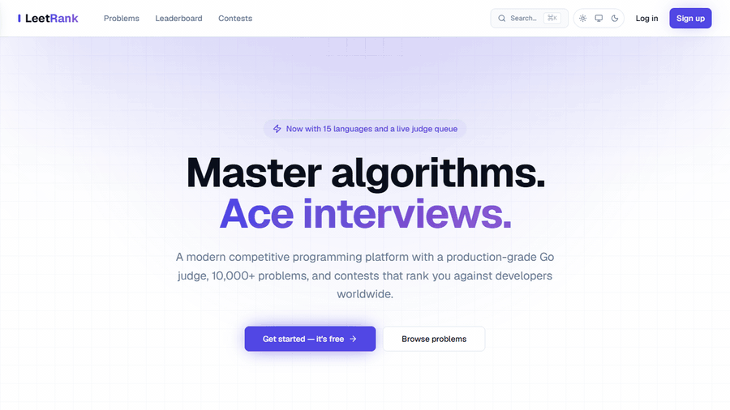
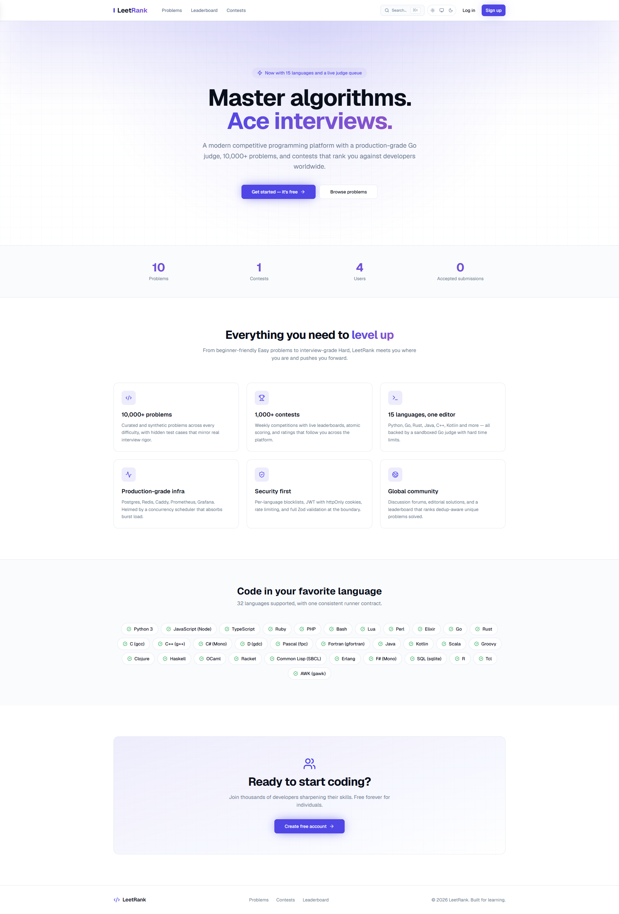
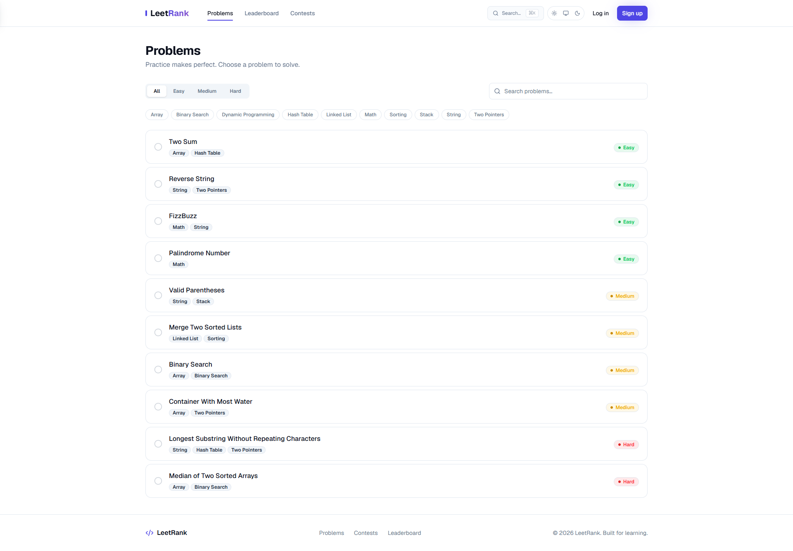
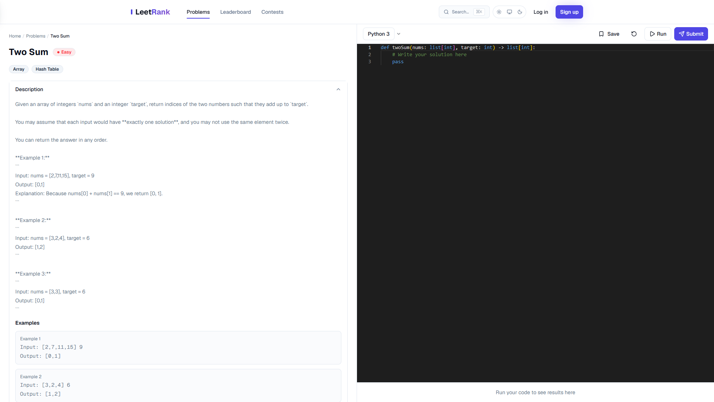
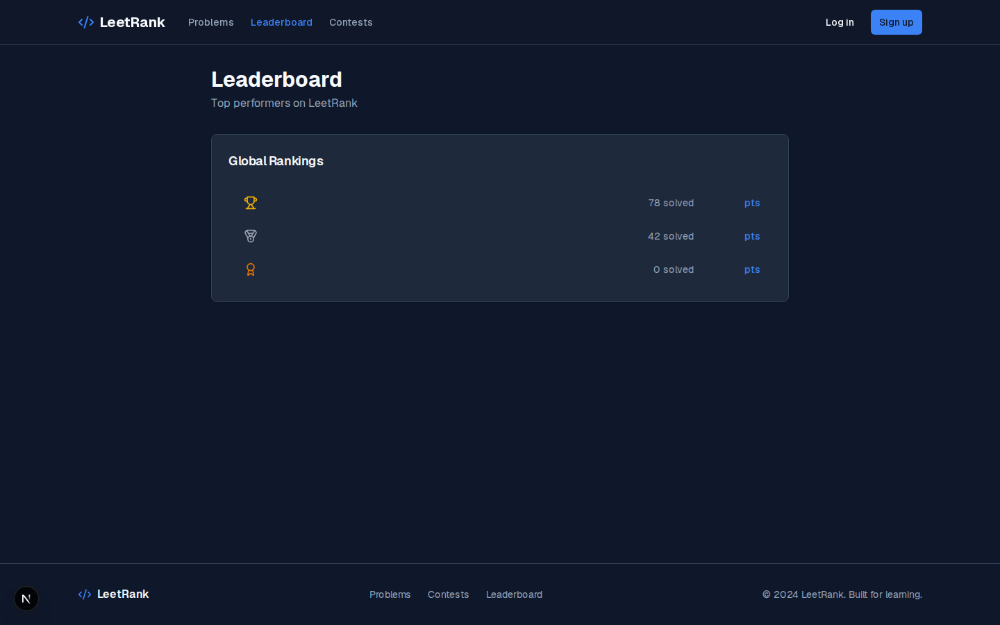
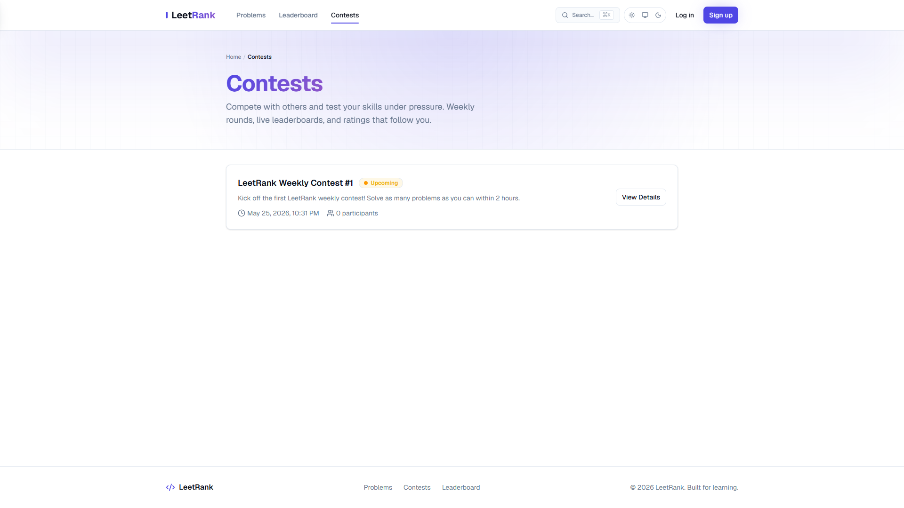
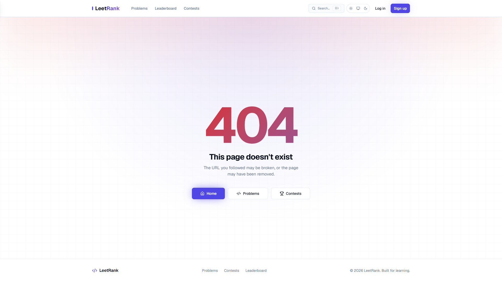
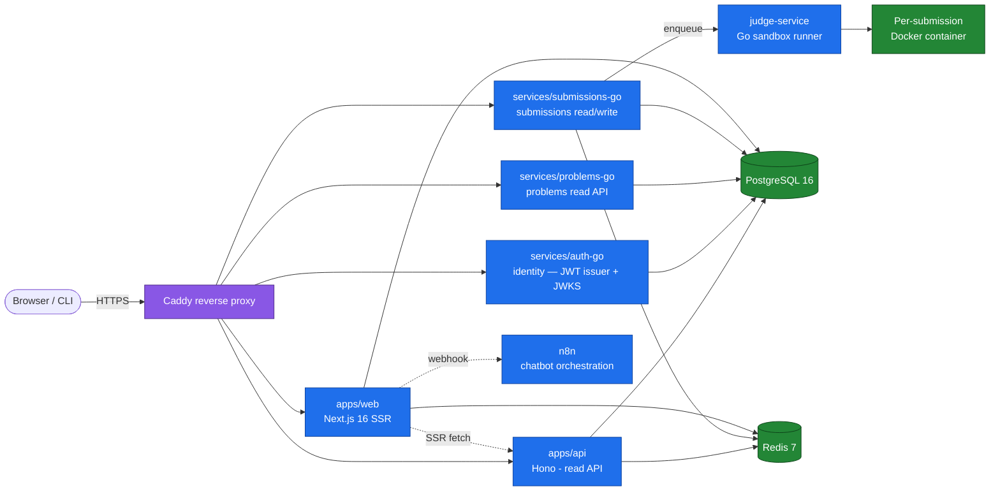

<div align="center">

# LeetRank

**A self-hostable, commercial-grade competitive programming platform.**
Solve, judge, rank — across 30+ languages, with real-time leaderboards and contest support.

🌐 **English** · [Tiếng Việt](README.vi.md)

[](https://github.com/JasonTM17/Leetrank_Project/actions/workflows/ci.yml)
[](https://hub.docker.com/r/nguyenson1710/leetrank-app)
[](https://github.com/JasonTM17?tab=packages&repo_name=Leetrank_Project)
[](LICENSE)
[](https://github.com/JasonTM17/Leetrank_Project/graphs/contributors)
[](https://github.com/JasonTM17/Leetrank_Project/commits/main)
[](https://codecov.io/gh/JasonTM17/Leetrank_Project)
[](https://github.com/JasonTM17/Leetrank_Project/releases)
[](https://github.com/JasonTM17/Leetrank_Project/actions/workflows/lighthouse.yml)

[Run locally](#run-locally) · [Architecture](#architecture) · [Services](#service-map) · [API](#api-reference) · [ADRs](docs/adr/) · [Contribute](CONTRIBUTING.md)

</div>

---

## Demo

<p align="center">
  
</p>

<p align="center">
  <em>Browse problems &middot; open the Monaco editor &middot; submit &middot; see verdict &middot; climb the leaderboard.</em>
</p>

## Screenshots

<table>
  <tr>
    <td width="50%"><a href="docs/screenshots/home.png"></a><div align="center"><sub><b>Home</b></sub></div></td>
    <td width="50%"><a href="docs/screenshots/problems.png"></a><div align="center"><sub><b>Problems</b></sub></div></td>
  </tr>
  <tr>
    <td width="50%"><a href="docs/screenshots/problem-detail.png"></a><div align="center"><sub><b>Problem &middot; editor &middot; verdict</b></sub></div></td>
    <td width="50%"><a href="docs/screenshots/leaderboard.png"></a><div align="center"><sub><b>Leaderboard</b></sub></div></td>
  </tr>
  <tr>
    <td width="50%"><a href="docs/screenshots/contests.png"></a><div align="center"><sub><b>Contests</b></sub></div></td>
    <td width="50%"><a href="docs/screenshots/status.png"></a><div align="center"><sub><b>Public status page</b></sub></div></td>
  </tr>
</table>

<p align="center">
  Also available: <a href="docs/screenshots/api-docs.png">API docs</a> &middot;
  <a href="docs/screenshots/dark/home.png">dark mode</a> &middot;
  <a href="docs/screenshots/mobile/home.png">mobile</a> &middot;
  <a href="docs/screenshots/demo.webm">demo.webm</a>
</p>

## Try it locally

```bash
git clone https://github.com/JasonTM17/Leetrank_Project.git
cd Leetrank_Project
cp .env.example .env
docker compose -f docker-compose.yml -f docker-compose.local.yml up -d
# Then open http://localhost:3000
```

Full instructions, port matrix, and native-dev workflow are in [Run locally](#run-locally) below.

---

## Status

Live CI signal. Click any badge for the underlying workflow run.

| Lane | Badge |
|------|-------|
| Build, lint, typecheck, unit tests | [](https://github.com/JasonTM17/Leetrank_Project/actions/workflows/ci.yml) |
| Docker images publish to Docker Hub | [](https://github.com/JasonTM17/Leetrank_Project/actions/workflows/docker-publish.yml) |
| Playwright end-to-end suite | [](https://github.com/JasonTM17/Leetrank_Project/actions/workflows/e2e.yml) |
| API contract tests (Hono read API) | [](https://github.com/JasonTM17/Leetrank_Project/actions/workflows/api-tests.yml) |
| Lighthouse performance + a11y budget | [](https://github.com/JasonTM17/Leetrank_Project/actions/workflows/lighthouse.yml) |
| Bundle size budget | [](https://github.com/JasonTM17/Leetrank_Project/actions/workflows/bundle.yml) |
| CodeQL SAST | [](https://github.com/JasonTM17/Leetrank_Project/actions/workflows/codeql.yml) |
| Trivy vulnerability scan | [](https://github.com/JasonTM17/Leetrank_Project/actions/workflows/trivy.yml) |
| Gitleaks secret scan | [](https://github.com/JasonTM17/Leetrank_Project/actions/workflows/gitleaks.yml) |
| SBOM (SPDX) | [](https://github.com/JasonTM17/Leetrank_Project/actions/workflows/sbom.yml) |
| Load test harness | [](https://github.com/JasonTM17/Leetrank_Project/actions/workflows/load-test.yml) |
| Postgres backup verification | [](https://github.com/JasonTM17/Leetrank_Project/actions/workflows/postgres-backup.yml) |
| Python service tests (analytics) | [](https://github.com/JasonTM17/Leetrank_Project/actions/workflows/python-tests.yml) |
| Ruby service tests (notifications) | [](https://github.com/JasonTM17/Leetrank_Project/actions/workflows/ruby-tests.yml) |
| Rust service tests (leaderboard) | [](https://github.com/JasonTM17/Leetrank_Project/actions/workflows/rust-tests.yml) |
| Tagged release publish | [](https://github.com/JasonTM17/Leetrank_Project/actions/workflows/release.yml) |
| Stale issue + PR sweep | [](https://github.com/JasonTM17/Leetrank_Project/actions/workflows/stale.yml) |

Live service health for the deployed instance is at `/status` ([screenshot](docs/screenshots/status.png)).

## What's new in v0.2.0

Roughly 500+ commits since `v0.1.0`. The full breakdown is in [CHANGELOG.md](CHANGELOG.md).

- **Study plans + daily challenge.** Curated multi-week paths (`/plans`) and a one-problem-per-day pinned challenge with streak counter and 365-day activity heatmap.
- **Achievements + badges.** Pure `evaluateAchievements` engine fired post-AC, badge grid at `/achievements`.
- **Editorial + progressive hints.** First-party walkthrough tab on every problem with click-to-reveal hints, gated until first AC or contest end.
- **Solution sharing + community votes.** Share your AC, upvote others, sort by votes / recent.
- **Glicko-2 rating + divisions.** Per-user skill rating with Codeforces-style colour bands, idempotent admin `finalize-rating`, division badges.
- **Recommendations engine.** Pure scorer over tag overlap + difficulty progression + freshness, mounted on home.
- **Admin analytics + DevOps console.** Aggregation endpoints, SVG chart primitives, CI-runs / queue-depth tiles.
- **Code playback (feature-flagged).** Recorder + viewer for keystroke-level replay of submission sessions.
- **Editor preferences.** Vim mode, theme picker, font size, tab width — live preview popover.
- **PWA + offline support, full EN + VI i18n on every surface.**

## Highlights

- **30+ languages judged in isolation.** Python, Go, Rust, C/C++, Java, Kotlin, Scala, JS/TS, Ruby, PHP, C#, Lua, R, SQL — every submission runs in a per-process [nsjail](https://github.com/google/nsjail) (Linux namespaces + cgroups + seccomp + capability drop) with strict CPU/memory/process/file-descriptor caps. Pattern blocklists are pre-flight defence-in-depth, not the boundary. See [ADR 0020](docs/adr/0020-judge-sandbox-model.md).
- **Polyglot microservices.** Frontend (Next.js 16) and ten backend services in five languages: Hono/TypeScript (`apps/api`), Go (`auth-go`, `problems-go`, `submissions-go`, `realtime-go`, `judge-service`), Rust (`leaderboard-rust`), Ruby (`notifications-ruby`), and Python (`analytics-python`). Each ships its own Dockerfile, port, runbook, and CI lane.
- **Real-time leaderboards.** Redis sorted sets for `O(log N)` rank-by-score lookups; Postgres remains the source of truth. Served by `leaderboard-rust`. See [ADR 0022](docs/adr/0022-leaderboard-caching-strategy.md).
- **Glicko-2 rating.** Per-user skill rating with confidence intervals — picked over plain Elo because contests are sparse and bursty. See [ADR 0021](docs/adr/0021-rating-algorithm.md).
- **Production-grade observability.** zerolog structured JSON logs, Prometheus metrics, OpenTelemetry tracing, Grafana dashboards. See [ADR 0024](docs/adr/0024-observability-stack.md).
- **Container-first.** Multi-stage builds, distroless Go images, non-root users, healthchecks. Public images on [Docker Hub `nguyenson1710`](https://hub.docker.com/u/nguyenson1710) and [GHCR](https://github.com/JasonTM17?tab=packages) (see [ADR 0026](docs/adr/0026-dual-registry-publish.md)).

## Architecture



The split is deliberate. See [ADR 0011](docs/adr/0011-split-backend-frontend.md) for the rationale and [ADR 0018](docs/adr/0018-go-services-buildout.md) for the Go rewrite plan.

## Run locally

Requirements: Docker Desktop 4.30+ (or Docker Engine 24+ on Linux), Compose v2.

```bash
git clone https://github.com/JasonTM17/Leetrank_Project.git
cd Leetrank_Project
cp .env.example .env

# Boot the full stack — postgres, redis, judge, web, api, auth, go services.
docker compose -f docker-compose.yml -f docker-compose.local.yml up -d

# Tail the web service while it warms up.
docker compose logs -f app
```

Once the stack is healthy:

| URL | Service |
|-----|---------|
| http://localhost:3000 | Web frontend (`app` container) |
| http://localhost:4000 | Read API (`apps/api`) |
| http://localhost:4011 | Identity (`services/auth-go`) |
| http://localhost:4012 | Submissions (Go) |
| http://localhost:4013 | Problems (Go) |
| http://localhost:9090 | Judge service |
| http://localhost:5432 | PostgreSQL |
| http://localhost:6379 | Redis |

Tear down with `docker compose down -v` (the `-v` clears volumes).

### Native dev (without Docker)

```bash
pnpm install
cp .env.example .env

pnpm db:push      # apply Prisma schema to your local PG
pnpm db:seed      # load 100+ problems, tags, demo accounts
pnpm dev          # http://localhost:3000
```

Demo accounts after seeding: `admin@leetrank.local` / `Admin123!` and `demo@leetrank.local` / `Demo123!`.

## Features

- **Problem catalogue.** 100+ seed problems across easy/medium/hard, tagged by topic, with full Markdown statements, sample I/O, and visible test cases.
- **Online judge.** Submit code in any of 30+ languages; per-submission nsjail sandbox enforces CPU/wall-clock/memory/process limits and isolates the process via fresh PID, mount, and network namespaces. Pattern blocklists run as pre-flight defence-in-depth.
- **Contests.** Time-boxed events with their own problem set, frozen leaderboard, and post-event rating recompute.
- **Leaderboards.** All-time, weekly, contest-scoped — backed by Redis sorted sets with Postgres as source of truth.
- **Glicko-2 ratings.** Per-user rating with confidence interval; better than Elo for sparse, bursty competition.
- **Public profiles.** Solved/attempted history, rating timeline, contest record, language mix.
- **Discussions.** Per-problem threads with markdown rendering and code blocks.
- **Editor.** Monaco editor with language-aware autocomplete, keyboard shortcuts, themes.
- **Chatbot.** n8n-orchestrated assistant for hints and concept explanations. See [ADR 0019](docs/adr/0019-n8n-integration.md).
- **Status page.** Public `/status` route with live service health.

## Tech stack

| Layer | Choice | Why |
|------|--------|-----|
| Frontend | Next.js 16 (App Router), React 19, TypeScript 5 | App Router + Server Components. |
| Styling | Tailwind v4 + shadcn/ui primitives | Tokens-first; no runtime CSS-in-JS cost. |
| Editor | Monaco (dynamic import) | LSP-grade UX without bundle bloat. See [ADR 0010](docs/adr/0010-monaco-editor-dynamic-import.md). |
| Backend (TS) | Hono on Node 20 | Fastest mainstream TS HTTP framework, edge-portable. |
| Backend (Go) | chi + pgx v5 + slog | Sub-ms latency, distroless ~15 MB images. See [ADR 0017](docs/adr/0017-auth-go-rewrite.md). |
| Backend (Rust) | axum + tokio + sqlx | Used by `leaderboard-rust` for hot-path ranking. |
| Backend (Ruby) | Sinatra + Sidekiq | `notifications-ruby` outbound dispatch (SMTP / webhook). |
| Backend (Python) | FastAPI + asyncpg + numpy | `analytics-python` for heavy compute paths. |
| Database | PostgreSQL 16 | ACID, mature, Prisma-friendly. See [ADR 0002](docs/adr/0002-use-postgresql-over-sqlite.md). |
| ORM | Prisma 5 | Type-safe, generated client. See [ADR 0005](docs/adr/0005-prisma-orm.md). |
| Cache / Queue | Redis 7 | Sorted sets for ranking + queue for async judging. See [ADR 0007](docs/adr/0007-redis-for-cache-and-queue.md). |
| Reverse proxy | Caddy 2 | Auto-TLS, simple config. See [ADR 0008](docs/adr/0008-caddy-as-reverse-proxy.md). |
| Auth | jose (JWT HS256, Ed25519 via JWKS in 3.1.5+) | Edge-compatible, RFC-correct. See [ADR 0004](docs/adr/0004-jwt-with-jose-not-jsonwebtoken.md), [ADR 0030](docs/adr/0030-web-tier-jwt-cutover.md). |
| Validation | Zod (TS) / go-playground/validator (Go) | Schema-first server-side validation. See [ADR 0006](docs/adr/0006-zod-for-server-validation.md). |
| Judge runtime | Go 1.22, exec.CommandContext + nsjail | Per-submission nsjail jail (Linux NS + cgroups + seccomp + cap drop). Goroutine fan-out per test case, hard SIGKILL on timeout. See [ADR 0003](docs/adr/0003-go-for-judge-service.md), [ADR 0020](docs/adr/0020-judge-sandbox-model.md). |
| Realtime | Go + gorilla/websocket | `realtime-go` fans out judge verdicts and live contest events from Redis pubsub. |
| Observability | zerolog + Prometheus + OpenTelemetry | One ADR-blessed stack across services. See [ADR 0024](docs/adr/0024-observability-stack.md). |
| CI/CD | GitHub Actions, Docker Hub + GHCR dual-publish | Build + push on every `main` commit. See [ADR 0026](docs/adr/0026-dual-registry-publish.md). |

## Service map

| Path | Image | Port | Status | README |
|------|-------|------|--------|--------|
| `apps/web` (root `src/`) | `nguyenson1710/leetrank-app` | 3000 | Active | — |
| `apps/api` | `nguyenson1710/leetrank-api` | 4000 | Active | [README](apps/api/README.md) |
| `services/auth-go` | `nguyenson1710/leetrank-identity` | 4011 | Active (canonical auth) | [README](services/auth-go/README.md) |
| `services/problems-go` | `nguyenson1710/leetrank-problems-go` | 4013 | Active | [README](services/problems-go/README.md) |
| `services/submissions-go` | `nguyenson1710/leetrank-submissions-go` | 4012 | Active | [README](services/submissions-go/README.md) |
| `services/realtime-go` | `nguyenson1710/leetrank-realtime-go` | 4014 | Active | [README](services/realtime-go/README.md) |
| `services/leaderboard-rust` | `nguyenson1710/leetrank-leaderboard-rust` | 4015 | Active | [README](services/leaderboard-rust/README.md) |
| `services/notifications-ruby` | `nguyenson1710/leetrank-notifications-ruby` | 4016 | Active | [README](services/notifications-ruby/README.md) |
| `services/analytics-python` | `nguyenson1710/leetrank-analytics-python` | 4017 | Active | [README](services/analytics-python/README.md) |
| `judge-service` | `nguyenson1710/leetrank-judge` | 9090 | Active | [README](judge-service/README.md) |

Per-service runbooks ship in each service README (local dev, production deploy, on-call playbook). Cross-cutting operational runbooks live in [`docs/runbooks/`](docs/runbooks/) — see the [Runbooks INDEX](docs/runbooks/INDEX.md) for the alert-to-runbook map.

## Documentation index

### Architecture decisions

| # | Title |
|---|-------|
| [0001](docs/adr/0001-record-architecture-decisions.md) | Record architecture decisions |
| [0002](docs/adr/0002-use-postgresql-over-sqlite.md) | PostgreSQL over SQLite |
| [0003](docs/adr/0003-go-for-judge-service.md) | Go for the judge service |
| [0004](docs/adr/0004-jwt-with-jose-not-jsonwebtoken.md) | JWT with `jose`, not `jsonwebtoken` |
| [0005](docs/adr/0005-prisma-orm.md) | Prisma ORM |
| [0006](docs/adr/0006-zod-for-server-validation.md) | Zod for server-side validation |
| [0007](docs/adr/0007-redis-for-cache-and-queue.md) | Redis for cache and queue |
| [0008](docs/adr/0008-caddy-as-reverse-proxy.md) | Caddy as reverse proxy |
| [0009](docs/adr/0009-judge-concurrency-bounds.md) | Judge concurrency bounds |
| [0010](docs/adr/0010-monaco-editor-dynamic-import.md) | Monaco editor dynamic import |
| [0011](docs/adr/0011-split-backend-frontend.md) | Split backend and frontend |
| [0012](docs/adr/0012-bff-or-edge-rewrite.md) | BFF vs edge rewrite |
| [0013](docs/adr/0013-service-to-service-auth.md) | Service-to-service auth (Ed25519 JWKS) |
| [0014](docs/adr/0014-bff-or-direct.md) | BFF vs direct API access |
| [0015](docs/adr/0015-n8n-chatbot.md) | n8n-backed chatbot |
| [0016](docs/adr/0016-leetrank-auth-service.md) | leetrank-auth service |
| [0017](docs/adr/0017-auth-go-rewrite.md) | Auth-go rewrite |
| [0018](docs/adr/0018-go-services-buildout.md) | Go services buildout |
| [0019](docs/adr/0019-n8n-integration.md) | n8n integration for chatbot/automation |
| [0020](docs/adr/0020-judge-sandbox-model.md) | Judge sandbox model (Docker-per-submission) |
| [0021](docs/adr/0021-rating-algorithm.md) | Rating algorithm (Glicko-2) |
| [0022](docs/adr/0022-leaderboard-caching-strategy.md) | Leaderboard caching strategy |
| [0023](docs/adr/0023-multi-region-readiness.md) | Multi-region readiness plan |
| [0024](docs/adr/0024-observability-stack.md) | Observability stack |
| [0025](docs/adr/0025-secret-management.md) | Secret management |
| [0026](docs/adr/0026-dual-registry-publish.md) | Dual registry publish |
| [0027](docs/adr/0027-retire-apps-auth.md) | Retire apps/auth in favor of identity service |
| [0028](docs/adr/0028-performance-indexes-and-bundle.md) | Performance: hot-path indexes + per-service image trimming |
| [0029](docs/adr/0029-operations-hardening.md) | Operations hardening |
| [0030](docs/adr/0030-web-tier-jwt-cutover.md) | Web tier JWT cutover to JWKS verify-only |
| [0031](docs/adr/0031-i18n-rollout.md) | Internationalisation rollout (cookie locale + Vietnamese) |
| [0032](docs/adr/0032-multi-session-listing-deferred.md) | Multi-session listing deferred until Session model lands |

### Runbooks and reference

- [Onboarding guide](docs/onboarding.md)
- [Web app reference](docs/web-app.md)
- [Accessibility checklist](docs/accessibility.md)
- [Load testing harness](docs/load-testing.md)
- [Migrations](docs/migrations/)
- [Runbooks](docs/runbooks/)
- [Legal](docs/legal/)

### API reference

- Public read API (`apps/api`): [`apps/api/openapi.yaml`](apps/api/openapi.yaml)
- Auth API (`services/auth-go`): [`services/auth-go/openapi.yaml`](services/auth-go/openapi.yaml)
- Combined legacy spec (frozen): [`docs/openapi.yaml`](docs/openapi.yaml)

Lint specs locally with `pnpm openapi:lint` (uses Redocly).

## Project layout

```
.
├── apps/
│   └── api/              # Hono read API (port 4000)
├── services/
│   ├── auth-go/          # Identity service — sole canonical JWT issuer (port 4011)
│   ├── problems-go/      # Go problems read API (port 4013)
│   └── submissions-go/   # Go submissions read/write (port 4012)
├── judge-service/        # Go sandbox runner (port 9090)
├── src/                  # Next.js 16 web app
├── prisma/               # Schema, migrations, seed scripts
├── packages/             # Shared workspace packages
├── docs/                 # ADRs, runbooks, OpenAPI, onboarding
├── infra/                # Compose, Caddy, observability stack
├── e2e/                  # Playwright end-to-end suites
└── scripts/              # Maintenance and load-test scripts
```

## Contributing

We follow [Conventional Commits](https://www.conventionalcommits.org/), branch-per-feature, and PR-based review. Read [CONTRIBUTING.md](CONTRIBUTING.md) for the full workflow, then [CODE_OF_CONDUCT.md](CODE_OF_CONDUCT.md) for community standards.

Security disclosures go to **jasonbmt06@gmail.com** — see [SECURITY.md](SECURITY.md).

## License

[MIT](LICENSE) © Nguyễn Tiến Sơn.
