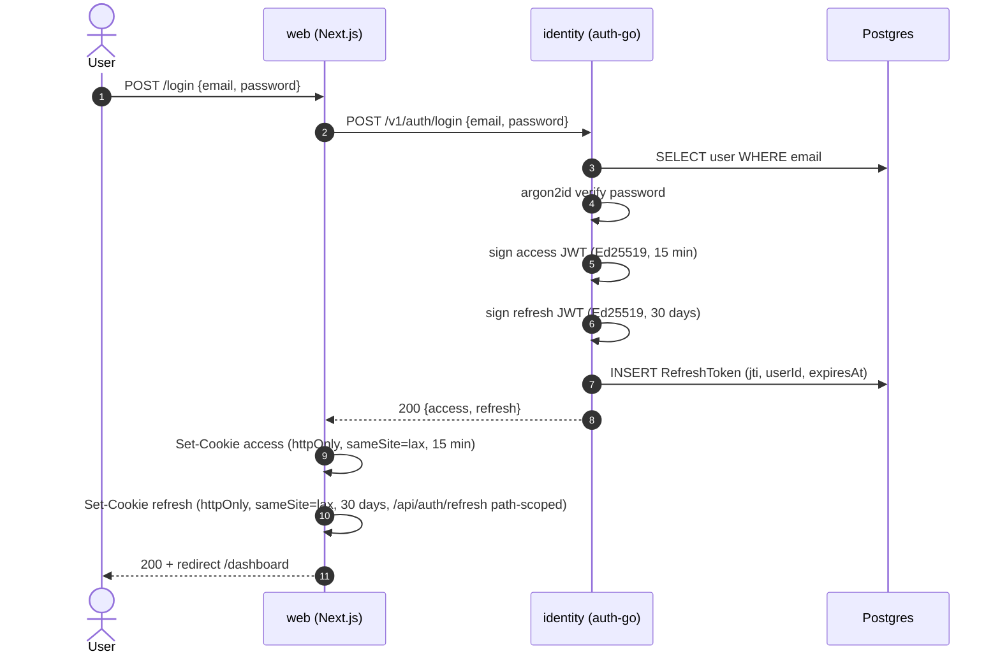
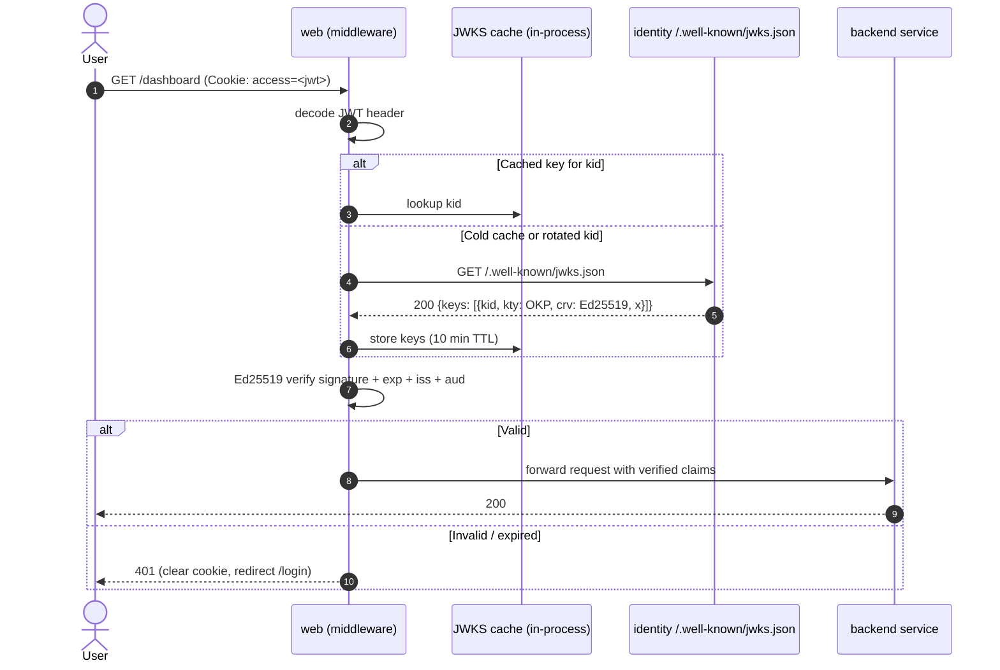
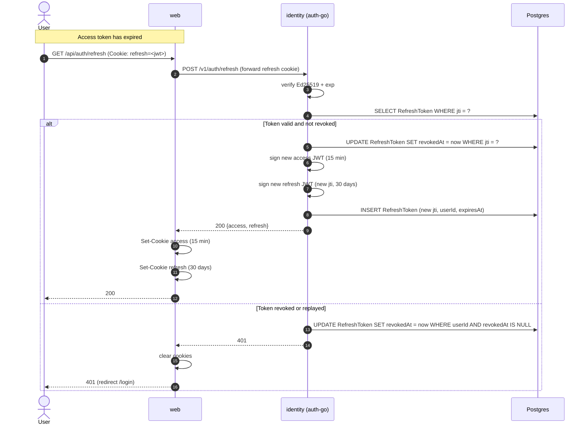
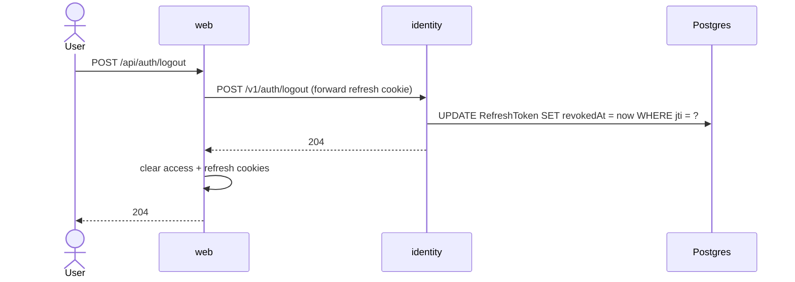

# Auth flow — Ed25519 + JWKS + refresh token rotation

LeetRank's authentication is split between the web tier (`src/lib/auth.ts`, `src/middleware.ts`) and the identity service (`services/auth-go`). The identity service is the sole canonical issuer of access and refresh tokens (see [ADR 0027](../adr/0027-retire-apps-auth.md)). The web tier verifies tokens against the identity service's JWKS endpoint and never holds the signing key.

This document covers the three flows that matter on-call: **login**, **request authorization**, and **refresh-token rotation**.

## Login

Key points:

- **Password hash:** argon2id with parameters owned by `services/auth-go`. Pepper is the `AUTH_PEPPER` env var; rotation is documented in [auth.md](../runbooks/auth.md).
- **Access TTL:** 15 minutes (cut down from the legacy 7-day default — see [ADR 0030](../adr/0030-web-tier-jwt-cutover.md)).
- **Refresh TTL:** 30 days. Stored in the `RefreshToken` table by `jti` (JWT ID) so revocation is a single-row update.
- **Cookie scoping:** the refresh cookie uses `Path=/api/auth/refresh` so browsers only send it to the rotation endpoint. The access cookie is sent on every request to the same origin.

## Request authorization

Key points:

- **No shared secret on the verify path.** The web tier holds public keys only. Compromising the web container does not let an attacker mint tokens.
- **JWKS cache:** `jose`'s `createRemoteJWKSet` caches keys in-process. A cold start during an identity outage fails closed; this is the documented trade-off in [ADR 0030](../adr/0030-web-tier-jwt-cutover.md).
- **Required claims:** `exp` (expiry), `iss` (must equal `https://identity.leetrank.local`), `aud` (must equal `leetrank-web`), `sub` (user id).
- **Algorithm guard:** the verify path rejects any `alg` other than `EdDSA` once `LEGACY_HS256_FALLBACK=false`. The legacy HS256 fallback exists only for the cutover window.

## Refresh-token rotation

Key points:

- **Rotation on every use.** The presented refresh token is revoked, and a new `jti` is issued. This implements the OWASP-recommended refresh-token rotation pattern.
- **Replay detection.** If the same `jti` is presented twice, the second attempt finds it already revoked. The handler treats this as a compromise signal and revokes **every** outstanding refresh token for that user — they are forced to log in again from every device.
- **Single-flight on the client.** The web tier serialises refresh attempts so two parallel requests with an expired access cookie don't both try to rotate (and trip the replay detector). Implemented in `src/lib/auth-fetch.ts`.

## Logout

Single-session logout. Multi-session listing and per-device revocation are deferred — see [ADR 0032](../adr/0032-multi-session-listing-deferred.md).

## Key rotation

The Ed25519 signing keypair is generated and stored by `services/auth-go`. The public-key half is published at `/.well-known/jwks.json` keyed by `kid`. Rotation procedure:

1. Generate a new keypair; bump the `kid`.
2. The identity service publishes **both** old and new public keys in JWKS. Existing access tokens (signed by the old `kid`) keep verifying.
3. Wait for `access TTL + cache TTL = 25 min` so all in-flight access tokens drain.
4. Stop signing with the old key.
5. Wait for `refresh TTL = 30 days` (or force-revoke active sessions for an emergency rotation).
6. Remove the old key from JWKS.

Full procedure is in [auth.md](../runbooks/auth.md).

## Headers and cookies cheat sheet

| Cookie | Path | TTL | HttpOnly | SameSite |
|---|---|---|---|---|
| `access` | `/` | 15 min | yes | lax |
| `refresh` | `/api/auth/refresh` | 30 days | yes | lax |
| `csrf` | `/` | session | no (readable for double-submit) | lax |

| Header | Where | Purpose |
|---|---|---|
| `Authorization: Bearer <jwt>` | `app` → backend services | Forwarded server-to-server; never set by the browser |
| `X-Request-Id` | every hop | Correlation id propagated via middleware |

## See also

- [services.md](services.md) — service inventory
- [data-flow.md](data-flow.md) — submission lifecycle
- [auth.md runbook](../runbooks/auth.md) — JWKS rotation, login alerts, on-call playbook
- [ADR 0004](../adr/0004-jwt-with-jose-not-jsonwebtoken.md) — JWT library choice
- [ADR 0013](../adr/0013-service-to-service-auth.md) — service-to-service Ed25519
- [ADR 0027](../adr/0027-retire-apps-auth.md) — single canonical auth service
- [ADR 0030](../adr/0030-web-tier-jwt-cutover.md) — JWKS verify-only cutover
- [ADR 0032](../adr/0032-multi-session-listing-deferred.md) — multi-session deferred
