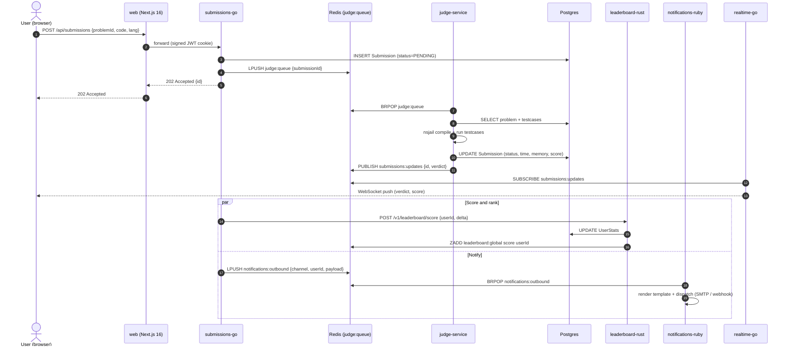

# Data flow — submission lifecycle

End-to-end path of a code submission from the editor to a final verdict, persisted score, and outbound notification.

## Sequence

## Steps

1. **Submit.** The editor on `/problems/[slug]` posts to `/api/submissions` with `{ problemId, code, lang }`. The web tier forwards to `submissions-go` carrying the user's signed JWT cookie.
2. **Persist + enqueue.** `submissions-go` validates the payload, writes a `Submission` row with `status=PENDING`, and `LPUSH`es the id onto the Redis `judge:queue` list. The HTTP response is `202 Accepted` immediately — no synchronous wait for verdict.
3. **Judge dequeue.** `judge-service` workers `BRPOP` the queue. Each worker fetches the problem and visible test cases from Postgres, compiles the code in an nsjail (Linux NS + cgroups + seccomp + cap drop), then runs every test case in parallel goroutines with hard CPU/wall/memory limits. See [ADR 0020](../adr/0020-judge-sandbox-model.md).
4. **Verdict.** The judge writes the final `verdict`, `runtimeMs`, `memoryKb`, and `score` back to Postgres and `PUBLISH`es `{submissionId, verdict}` on the `submissions:updates` Redis pubsub channel.
5. **Realtime push.** `realtime-go` subscribes to `submissions:updates` and fans the verdict out to every WebSocket client subscribed to that submission id. The browser updates the verdict pane without polling.
6. **Score + rank.** In parallel, `submissions-go` calls `leaderboard-rust` `POST /v1/leaderboard/score` with the rating delta. The Rust service updates `UserStats` in Postgres and `ZADD`s the new score to the `leaderboard:global` Redis sorted set. See [ADR 0022](../adr/0022-leaderboard-caching-strategy.md).
7. **Notify.** Also in parallel, `submissions-go` `LPUSH`es a payload to `notifications:outbound`. `notifications-ruby` workers `BRPOP` and dispatch over SMTP or HTTP webhook depending on the user's preferences.

## Failure modes

| Where | Failure | What happens |
|---|---|---|
| Step 2 | Postgres unavailable | `submissions-go` returns 503; client retries |
| Step 2 | Redis unavailable | Submission row exists with `status=PENDING`, no enqueue. Surfaced by `judge:queue:depth` flatlining; recovered by replay tool |
| Step 3 | Judge worker panic | Worker recycles; `judge:queue` re-delivers via reliable-queue helper |
| Step 4 | Judge timeout | nsjail SIGKILL on `time-limit-exceeded`; verdict written as `TLE` |
| Step 5 | `realtime-go` down | Browser falls back to polling `/api/submissions/:id` every 2s |
| Step 6 | `leaderboard-rust` 5xx | Rating delta queued for retry; ZSET catches up on next score event |
| Step 7 | `notifications-ruby` down | Payload sits in `notifications:outbound`; dispatched on recovery |

## Backpressure

The judge worker pool has a hard concurrency cap (see [ADR 0009](../adr/0009-judge-concurrency-bounds.md)). When `judge:queue` depth exceeds the alert threshold, the runbook playbook is in [judge.md](../runbooks/judge.md) — typically scale workers, never the queue.

## See also

- [services.md](services.md) — service inventory and ports
- [auth-flow.md](auth-flow.md) — how the JWT cookie in step 1 is verified
- [ADR 0009](../adr/0009-judge-concurrency-bounds.md), [ADR 0020](../adr/0020-judge-sandbox-model.md), [ADR 0022](../adr/0022-leaderboard-caching-strategy.md)
